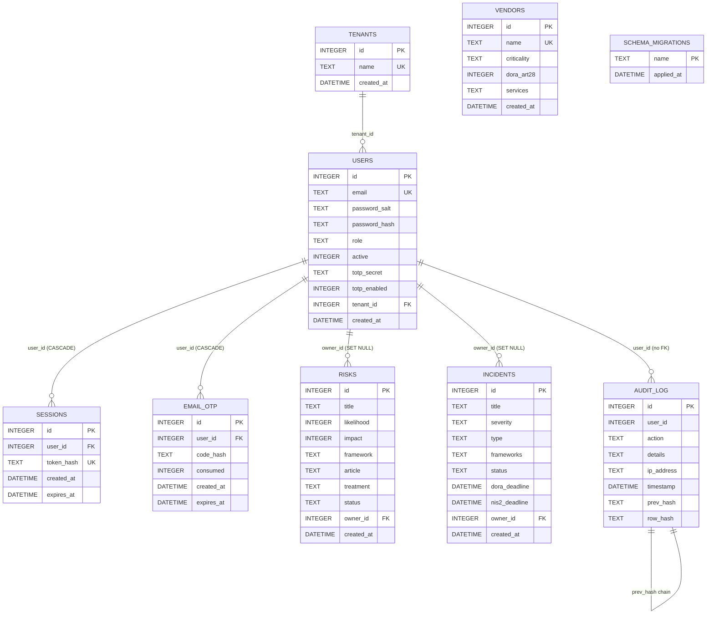

# HybridSOC — SQLite Database Schema

> Companion to [`system-design.md`](system-design.md) and [`../INTEGRITY.md`](../INTEGRITY.md).
> Source of truth: `services/web/migrations/*.sql`.
> Visual diagram: [`database-schema.drawio`](database-schema.drawio).

---

## 1. Overview

The HybridSOC web service uses a single SQLite database operating in **WAL
mode** with `foreign_keys=ON` and `synchronous=NORMAL`. It backs:

- IAM (users, sessions, MFA secrets, OTP one-time codes)
- Multi-tenancy (`tenants`)
- GRC (risks, incidents, vendors)
- An append-only, hash-chained audit trail (`audit_log`)
- The migration ledger (`schema_migrations`)

WAL was chosen because it allows concurrent readers (analyst dashboard
queries) while a single writer (the API) appends rows. The SHA-256
`prev_hash` / `row_hash` chain on `audit_log` gives tamper-evidence
without a separate ledger system (see INTEGRITY.md §2.1).

### Connection PRAGMA settings (`services/web/db.py`)

```sql
PRAGMA journal_mode = WAL;
PRAGMA synchronous  = NORMAL;
PRAGMA foreign_keys = ON;
```

---

## 2. Entity-Relationship overview



---

## 3. Tables

### 3.1 `tenants` — multi-tenant boundary

| Column     | Type     | Constraints                     | Notes |
|------------|----------|---------------------------------|-------|
| id         | INTEGER  | PK, AUTOINCREMENT                | tenant id |
| name       | TEXT     | NOT NULL, UNIQUE                 | display name |
| created_at | DATETIME | DEFAULT CURRENT_TIMESTAMP        | audit |

```sql
CREATE TABLE tenants (
    id          INTEGER PRIMARY KEY AUTOINCREMENT,
    name        TEXT NOT NULL UNIQUE,
    created_at  DATETIME DEFAULT CURRENT_TIMESTAMP
);
```

### 3.2 `users` — identity store

| Column         | Type     | Constraints                                                | Notes |
|----------------|----------|------------------------------------------------------------|-------|
| id             | INTEGER  | PK, AUTOINCREMENT                                           | user id |
| email          | TEXT     | NOT NULL, UNIQUE                                            | login id (lowercased) |
| password_salt  | TEXT     | NOT NULL                                                    | base64 16-byte salt |
| password_hash  | TEXT     | NOT NULL                                                    | base64 PBKDF2-SHA256 (260 000 iter) of `password + PEPPER` |
| role           | TEXT     | NOT NULL, DEFAULT `'analyst'`                              | analyst / manager / compliance / admin / superadmin |
| active         | INTEGER  | NOT NULL, DEFAULT 1                                         | soft-delete flag |
| totp_secret    | TEXT     | NULL                                                        | base32 RFC 6238 secret |
| totp_enabled   | INTEGER  | NOT NULL, DEFAULT 0                                         | 1 once activated |
| tenant_id      | INTEGER  | FK → tenants(id) ON DELETE SET NULL                         | nullable |
| created_at     | DATETIME | DEFAULT CURRENT_TIMESTAMP                                   | audit |

```sql
CREATE TABLE users (
    id              INTEGER PRIMARY KEY AUTOINCREMENT,
    email           TEXT NOT NULL UNIQUE,
    password_salt   TEXT NOT NULL,
    password_hash   TEXT NOT NULL,
    role            TEXT NOT NULL DEFAULT 'analyst',
    active          INTEGER NOT NULL DEFAULT 1,
    totp_secret     TEXT,
    totp_enabled    INTEGER NOT NULL DEFAULT 0,
    tenant_id       INTEGER REFERENCES tenants(id) ON DELETE SET NULL,
    created_at      DATETIME DEFAULT CURRENT_TIMESTAMP
);
```

The global `HYBRIDSOC_PEPPER` is **not** stored in the database — it is read
from the environment so a DB-only leak is insufficient for an offline attack.

### 3.3 `sessions` — Bearer-token store (hashed)

| Column     | Type     | Constraints                                       | Notes |
|------------|----------|---------------------------------------------------|-------|
| id         | INTEGER  | PK, AUTOINCREMENT                                  | session id |
| user_id    | INTEGER  | NOT NULL, FK → users(id) ON DELETE CASCADE         | owner |
| token_hash | TEXT     | NOT NULL, UNIQUE                                   | SHA-256 of the raw token |
| created_at | DATETIME | DEFAULT CURRENT_TIMESTAMP                          | issued |
| expires_at | DATETIME | NOT NULL                                           | TTL = `SESSION_TTL_SECONDS` (default 8 h) |

```sql
CREATE TABLE sessions (
    id          INTEGER PRIMARY KEY AUTOINCREMENT,
    user_id     INTEGER NOT NULL REFERENCES users(id) ON DELETE CASCADE,
    token_hash  TEXT NOT NULL UNIQUE,
    created_at  DATETIME DEFAULT CURRENT_TIMESTAMP,
    expires_at  DATETIME NOT NULL
);
CREATE INDEX idx_sessions_user ON sessions(user_id);
```

### 3.4 `email_otp` — one-time MFA codes

| Column     | Type     | Constraints                                       | Notes |
|------------|----------|---------------------------------------------------|-------|
| id         | INTEGER  | PK, AUTOINCREMENT                                  | OTP id |
| user_id    | INTEGER  | NOT NULL, FK → users(id) ON DELETE CASCADE         | recipient |
| code_hash  | TEXT     | NOT NULL                                           | SHA-256 of the 6-digit code |
| consumed   | INTEGER  | NOT NULL, DEFAULT 0                                | 1 after successful verify |
| created_at | DATETIME | DEFAULT CURRENT_TIMESTAMP                          | issued |
| expires_at | DATETIME | NOT NULL                                           | TTL = `OTP_TTL_SECONDS` (default 5 min) |

```sql
CREATE TABLE email_otp (
    id          INTEGER PRIMARY KEY AUTOINCREMENT,
    user_id     INTEGER NOT NULL REFERENCES users(id) ON DELETE CASCADE,
    code_hash   TEXT NOT NULL,
    consumed    INTEGER NOT NULL DEFAULT 0,
    created_at  DATETIME DEFAULT CURRENT_TIMESTAMP,
    expires_at  DATETIME NOT NULL
);
CREATE INDEX idx_email_otp_user ON email_otp(user_id);
```

### 3.5 `audit_log` — append-only hash-chained trail

| Column     | Type     | Constraints                | Notes |
|------------|----------|----------------------------|-------|
| id         | INTEGER  | PK, AUTOINCREMENT           | row id |
| user_id    | INTEGER  | NULL                        | actor (NULL for failed login attempts) |
| action     | TEXT     | NOT NULL                    | event name (e.g. `login_password_ok`) |
| details    | TEXT     | NULL                        | free-form context |
| ip_address | TEXT     | NULL                        | client IP |
| timestamp  | DATETIME | DEFAULT CURRENT_TIMESTAMP   | UTC |
| prev_hash  | TEXT     | NOT NULL                    | SHA-256 of the previous row's `row_hash` (genesis = 64 × `0`) |
| row_hash   | TEXT     | NOT NULL                    | SHA-256(`prev_hash` ‖ canonical JSON of payload) |

Deliberately **no** foreign key on `user_id`: rows must survive user deletion
to satisfy the immutability requirement.

```sql
CREATE TABLE audit_log (
    id          INTEGER PRIMARY KEY AUTOINCREMENT,
    user_id     INTEGER,
    action      TEXT NOT NULL,
    details     TEXT,
    ip_address  TEXT,
    timestamp   DATETIME DEFAULT CURRENT_TIMESTAMP,
    prev_hash   TEXT NOT NULL,
    row_hash    TEXT NOT NULL
);
CREATE INDEX idx_audit_user   ON audit_log(user_id);
CREATE INDEX idx_audit_action ON audit_log(action);
```

Hash-chain construction (see `services/web/audit.py`):

```python
canonical = json.dumps({"user_id":..., "action":..., "details":..., "ip_address":...},
                       sort_keys=True, separators=(",", ":"))
row_hash  = sha256(prev_hash + canonical).hexdigest()
```

`/api/audit/verify` re-walks the chain and reports the first row where
`prev_hash` or the recomputed `row_hash` mismatch.

### 3.6 `risks` — risk register

| Column     | Type     | Constraints                                          | Notes |
|------------|----------|------------------------------------------------------|-------|
| id         | INTEGER  | PK, AUTOINCREMENT                                     | risk id |
| title      | TEXT     | NOT NULL                                              | description |
| likelihood | INTEGER  | NOT NULL, CHECK BETWEEN 1 AND 5                       | ISO 31000 |
| impact     | INTEGER  | NOT NULL, CHECK BETWEEN 1 AND 5                       | ISO 31000 |
| framework  | TEXT     | NULL                                                  | DORA / NIS2 / ISO27001 / GDPR / EUAI |
| article    | TEXT     | NULL                                                  | e.g. `Art.28` |
| treatment  | TEXT     | NULL                                                  | mitigation plan |
| status     | TEXT     | NOT NULL, DEFAULT `'open'`                           | open / mitigated / accepted |
| owner_id   | INTEGER  | FK → users(id) ON DELETE SET NULL                     | nullable |
| created_at | DATETIME | DEFAULT CURRENT_TIMESTAMP                             | audit |

```sql
CREATE TABLE risks (
    id          INTEGER PRIMARY KEY AUTOINCREMENT,
    title       TEXT NOT NULL,
    likelihood  INTEGER NOT NULL CHECK (likelihood BETWEEN 1 AND 5),
    impact      INTEGER NOT NULL CHECK (impact BETWEEN 1 AND 5),
    framework   TEXT,
    article     TEXT,
    treatment   TEXT,
    status      TEXT NOT NULL DEFAULT 'open',
    owner_id    INTEGER REFERENCES users(id) ON DELETE SET NULL,
    created_at  DATETIME DEFAULT CURRENT_TIMESTAMP
);
```

### 3.7 `incidents` — ICT / NIS2 / GDPR incidents

| Column        | Type     | Constraints                                       | Notes |
|---------------|----------|---------------------------------------------------|-------|
| id            | INTEGER  | PK, AUTOINCREMENT                                  | incident id |
| title         | TEXT     | NOT NULL                                           |  |
| severity      | TEXT     | NOT NULL, DEFAULT `'Medium'`                      | Low / Medium / High / Critical |
| type          | TEXT     | NOT NULL, DEFAULT `'ICT_INCIDENT'`                | ICT_INCIDENT / SIGNIFICANT_INCIDENT / DATA_BREACH |
| frameworks    | TEXT     | NULL                                               | comma-separated DORA,NIS2 |
| status        | TEXT     | NOT NULL, DEFAULT `'open'`                        |  |
| dora_deadline | DATETIME | NULL                                               | DORA Art. 17 — `created_at + 72 h` |
| nis2_deadline | DATETIME | NULL                                               | NIS2 Art. 21 — `created_at + 24 h` |
| owner_id      | INTEGER  | FK → users(id) ON DELETE SET NULL                  | reporter |
| created_at    | DATETIME | DEFAULT CURRENT_TIMESTAMP                          | audit |

```sql
CREATE TABLE incidents (
    id              INTEGER PRIMARY KEY AUTOINCREMENT,
    title           TEXT NOT NULL,
    severity        TEXT NOT NULL DEFAULT 'Medium',
    type            TEXT NOT NULL DEFAULT 'ICT_INCIDENT',
    frameworks      TEXT,
    status          TEXT NOT NULL DEFAULT 'open',
    dora_deadline   DATETIME,
    nis2_deadline   DATETIME,
    owner_id        INTEGER REFERENCES users(id) ON DELETE SET NULL,
    created_at      DATETIME DEFAULT CURRENT_TIMESTAMP
);
```

### 3.8 `vendors` — Third-Party Risk Management (DORA Art. 28)

| Column      | Type     | Constraints                          | Notes |
|-------------|----------|--------------------------------------|-------|
| id          | INTEGER  | PK, AUTOINCREMENT                     | vendor id |
| name        | TEXT     | NOT NULL, UNIQUE                      | display name |
| criticality | TEXT     | NOT NULL, DEFAULT `'Medium'`         | Low / Medium / High / Critical |
| dora_art28  | INTEGER  | NOT NULL, DEFAULT 0                   | 1 if subject to DORA Art. 28 |
| services    | TEXT     | NULL                                  | comma-separated services |
| created_at  | DATETIME | DEFAULT CURRENT_TIMESTAMP             | audit |

```sql
CREATE TABLE vendors (
    id          INTEGER PRIMARY KEY AUTOINCREMENT,
    name        TEXT NOT NULL UNIQUE,
    criticality TEXT NOT NULL DEFAULT 'Medium',
    dora_art28  INTEGER NOT NULL DEFAULT 0,
    services    TEXT,
    created_at  DATETIME DEFAULT CURRENT_TIMESTAMP
);
```

### 3.9 `schema_migrations` — migration ledger

Created automatically by `services/web/db.py::run_migrations` before any
user migration is applied.

```sql
CREATE TABLE schema_migrations (
    name        TEXT PRIMARY KEY,
    applied_at  DATETIME DEFAULT CURRENT_TIMESTAMP
);
```

---

## 4. Indexes

| Index              | Table     | Columns    | Reason |
|--------------------|-----------|------------|--------|
| `idx_sessions_user`  | sessions  | user_id    | revoke-all-sessions / list per user |
| `idx_email_otp_user` | email_otp | user_id    | latest unconsumed OTP lookup |
| `idx_audit_user`     | audit_log | user_id    | per-user activity timeline |
| `idx_audit_action`   | audit_log | action     | filter by event type |

`UNIQUE` constraints (`tenants.name`, `users.email`, `sessions.token_hash`,
`vendors.name`) are also implicitly indexed by SQLite.

---

## 5. Retention policy (GDPR Art. 5(1)(c) / (e))

Drawn from INTEGRITY.md §2.3 — enforced by scheduled purge jobs:

| Table       | Retention                | Justification |
|-------------|--------------------------|---------------|
| `audit_log` | 12 months                | ISO 27001 A.8.15 / NIS2 Art. 21 |
| `sessions`  | until `expires_at`       | GDPR Art. 5(1)(e) |
| `email_otp` | until `expires_at`       | minimal exposure |
| `risks`     | indefinite while open    | GRC requirement |
| `incidents` | 24 months after closure  | DORA Art. 9 |

A rolling 90-day pseudonymisation step applies to `users.email` for inactive
accounts (planned).

---

## 6. Reference queries

```sql
-- Active session for a token (constant-time hash compare in code)
SELECT u.id, u.email, u.role, u.totp_enabled
  FROM sessions s
  JOIN users u ON u.id = s.user_id
 WHERE s.token_hash = ? AND s.expires_at > datetime('now');

-- Latest unconsumed OTP for a user
SELECT id, code_hash
  FROM email_otp
 WHERE user_id = ? AND consumed = 0
   AND expires_at > datetime('now')
 ORDER BY id DESC LIMIT 1;

-- Risk register sorted by inherent risk (likelihood × impact)
SELECT id, title, likelihood, impact, framework, status
  FROM risks
 ORDER BY likelihood * impact DESC, id DESC;

-- Incidents whose DORA deadline is within 4 hours
SELECT id, title, severity, dora_deadline
  FROM incidents
 WHERE status = 'open'
   AND dora_deadline BETWEEN datetime('now') AND datetime('now', '+4 hours');

-- Most recent 200 audit entries (admin view)
SELECT id, user_id, action, details, ip_address, timestamp, row_hash
  FROM audit_log
 ORDER BY id DESC
 LIMIT 200;

-- Walk the chain to verify integrity (server-side; see audit.verify_chain)
SELECT id, user_id, action, details, ip_address, prev_hash, row_hash
  FROM audit_log
 ORDER BY id ASC;

-- Dashboard KPIs
SELECT
  (SELECT COUNT(*) FROM users)                              AS users,
  (SELECT COUNT(*) FROM incidents WHERE status = 'open')    AS open_incidents,
  (SELECT COUNT(*) FROM risks)                              AS risks,
  (SELECT COUNT(*) FROM audit_log)                          AS audit_entries;

-- Risk bucket distribution
SELECT CASE
         WHEN likelihood * impact >= 20 THEN 'Critical'
         WHEN likelihood * impact >= 12 THEN 'High'
         WHEN likelihood * impact >= 6  THEN 'Medium'
         ELSE 'Low'
       END AS bucket, COUNT(*) AS count
  FROM risks
 GROUP BY bucket;
```

---

## 7. Migration workflow

Migrations are plain SQL files under `services/web/migrations/`, applied
in **lexicographic order** exactly once per database. The runner:

1. Creates `schema_migrations` if it does not exist.
2. Loads applied names into a set.
3. For each `*.sql` file, if its name is not in the set, executes it inside
   a transaction and inserts the name into `schema_migrations`.

CLI:

```bash
python -m services.web.migrate              # apply pending
python -m services.web.migrate --status     # show applied vs pending
python -m services.web.migrate --bootstrap  # apply + create superadmin
python -m services.web.migrate --verify     # re-walk audit hash chain
```

Naming convention: `NNNN_<short_topic>.sql` — e.g. `0003_documents.sql`.

Backward-incompatible changes require a new migration file (never edit a
shipped one) so existing databases converge to the same schema deterministically.
